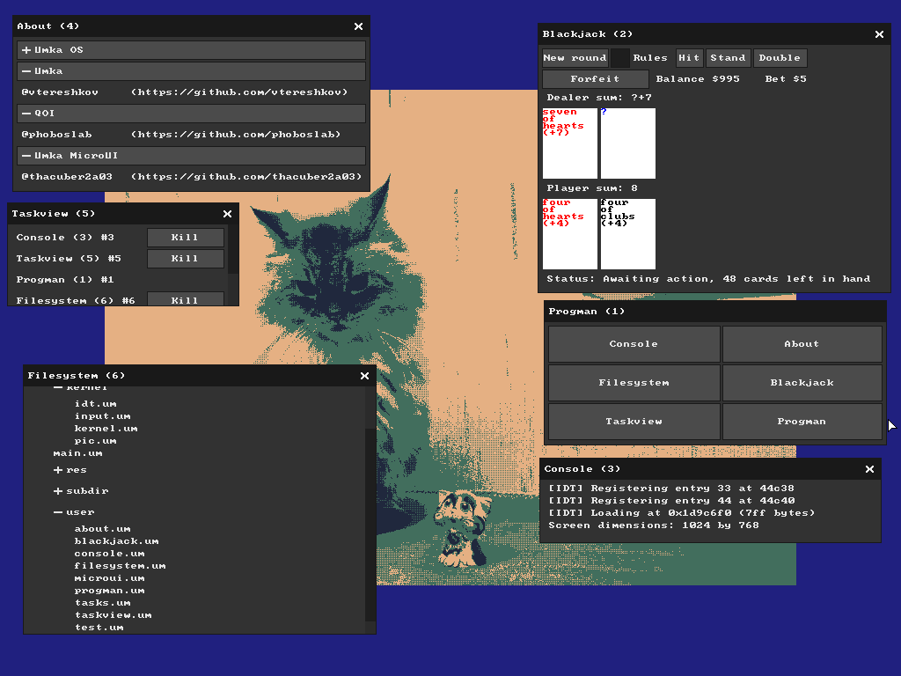

# Umka OS

A proof of concept operating system written in [Umka](https://github.com/vtereshkov/umka-lang). (With blackjack and hookers (maybe just blackjack))



# Table of Contents

* [Usage and Installation](#usage-and-installation)
* [Building](#building)
* [Why and how](#why-and-how)
* [Technology](#technology)
* [Contributing](#contributing)

# Usage and Installation

Currently, this OS uses a legacy BIOS bootloader, so it's unlikely to run on actual hardware.
Later I'll make an effort to port this to UEFI.

To try it out, I recommend to go to the release pages, download the latest sys.img, and run the following command:

```
qemu-system-x86_64 -m 128 -drive file=sys.img,format=raw
```

You need to install QEMU for this to work. Alternatively you can try any other virtual machine software such as VirtualBox (but I did not test it).

# Building

To build, use the Makefile provided in the repository. Dependencies are:

* gcc
* binutils
* python3
* nasm

Upon clone, install submodules: `git submodule init --recursive`

# Why and how

Because I can :P

It started as a random idea, it was going to be a lot of work from the start.

I started with re-implementing libc subset used by Umka, which you can find under `sys/mock_libc`.
A few basic things had to be implemented, for the most part a simple allocator and a virtual file system.
After that was done, I implemented the formatting functions (which took me longer than I expected.)

When it came to the OS, I scraped some of my old code, found my old bootloader, fixed it, and booted into Umka.
And it didn't go all that smooth, there was a lot of trouble. I'm going to need to write a dedicated post for that later. This took me about a week to make this, it's a bit rushed, but it works.

# Technology 

The standard library:

* `alloc.c` Custom allocator. No brainer, since I can't use libc provided by the system. The allocator is pretty inefficient but a good enough free-list allocator.
* `vfs.c` Virtual file system. It's just a tree data structure, it's somewhat hacky - for example, files can contain other files, because there's not distinction between directories. The virtual file system is needed for file operations. The file `mkfs.py` creates an embedded image of the filesystem from the `fs/` directory.
* `fmt.c` This was probably the most work out of the C standard library, mostly the scanning and formatting functions, and yes in the end they did trip me up during the OS development, even after testing.
* `arith.c` Not written by me, these are public domain floating point functions, otherwise it wouldn't compile.

Moving on to the system: 

The system has a kernel, written mostly in Umka, with exception for IRQ handling (due to multithreading constraints).

* `main.c` Bootstraps the VFS image, sets up Umka and graphics.
* `gfx.c` A primitve graphics output library, it uses [rxi's cached software rendering](https://rxi.github.io/cached_software_rendering.html) to increase the render performance significantly.
* `umka.c` Where most of the stuff happens, here the IRQ's are handled and sent to Umka.

From this point, most of the code is handled in Umka, you can find it in `fs/`

* `main.um` Is mostly just a relay to call other functions.
* `kernel.um` `idt.um` `input.um` `pic.um` a simple kernel, it handles the IDT initialization, and the mouse driver.
* `microui.um` a very nice recreation of microui for Umka by @thacuber2a03
* `user.um` and the programs ... the provided example software, it even includes a blackjack game, check it out!

And extra:

* `qoi.c`, I use QOI for icons and the background.

Limitations:

* It's limited by 480kb, since it can not address more memory in the bootloader. Could potentially be solved later by using UEFI instead.

There's not much advanced things here, but it all somehow works, and that feels really good.

# Contributing

Always welcome =) Please mind the 480 KB limit.